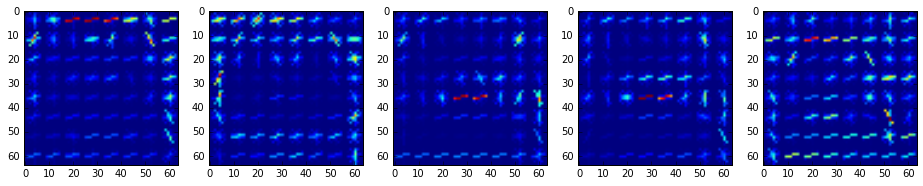

##Vehicle Detection Project

The goals / steps of this project are the following:

* Perform a Histogram of Oriented Gradients (HOG) feature extraction on a labeled training set of images and train a classifier Linear SVM classifier
* Optionally, you can also apply a color transform and append binned color features, as well as histograms of color, to your HOG feature vector. 
* Note: for those first two steps don't forget to normalize your features and randomize a selection for training and testing.
* Implement a sliding-window technique and use your trained classifier to search for vehicles in images.
* Run your pipeline on a video stream (start with the test_video.mp4 and later implement on full project_video.mp4) and create a heat map of recurring detections frame by frame to reject outliers and follow detected vehicles.
* Estimate a bounding box for vehicles detected.

[//]: # (Image References)
[image1]: ./examples/car_not_car.png
[image2]: ./examples/HOG_example.jpg
[image3]: ./examples/sliding_windows.jpg
[image4]: ./examples/sliding_window.jpg
[image5]: ./examples/bboxes_and_heat.png
[image6]: ./examples/labels_map.png
[image7]: ./examples/output_bboxes.png
[video1]: ./project_video.mp4

## [Rubric](https://review.udacity.com/#!/rubrics/513/view) Points
### Here I will consider the rubric points individually and describe how I addressed each point in my implementation.  

---
### Writeup / README

#### 1. Provide a Writeup / README that includes all the rubric points and how you addressed each one.  You can submit your writeup as markdown or pdf.  [Here](https://github.com/udacity/CarND-Vehicle-Detection/blob/master/writeup_template.md) is a template writeup for this project you can use as a guide and a starting point.  

You're reading it!

### Histogram of Oriented Gradients (HOG)

#### 1. Explain how (and identify where in your code) you extracted HOG features from the training images.

The code for this step is contained in the first code cell of the IPython notebook in the cells under titles of **Loading and visualisation of training data** and **Histogram of Gradients**

I started by reading in all the `vehicle` and `non-vehicle` images.  Here is an example of one of each of the `vehicle` and `non-vehicle` classes:


Then I've extracted Histogram of Gradients from random cars and non-cars images using `skimage.feature.hog` function:




![alt text][image2]

#### 2. Explain how you settled on your final choice of HOG parameters.

I tried various combinations of parameters manually and picked an optimum according to the accuracy of LinearSVC classifier and detection results which I visualised on the image:
  
```python
color_space = 'HLS' # Can be RGB, HSV, LUV, HLS, YUV, YCrCb
orient = 8  # HOG orientations
pix_per_cell = 8 # HOG pixels per cell
cell_per_block = 2 # HOG cells per block
hog_channel = 'ALL' # Can be 0, 1, 2, or "ALL"
spatial_size = (32, 32) # Spatial binning dimensions
hist_bins = 32    # Number of histogram bins
spatial_feat = True # Spatial features on or off
hist_feat = True # Histogram features on or off
hog_feat = True # HOG features on or off
y_start_stop = [350, 660] # Min and max in y to search in slide_window()
```


#### 3. Describe how (and identify where in your code) you trained a classifier using your selected HOG features (and color features if you used them).

I trained a linear SVM using functions form sklearn library. The pipeline is:
* Extract features: HOG, Spatial binning of color, Histogram of colort
* Scale features
* Concatenate the features into single vector for eact sample
* Stack cars and non-cars features
* Stack Ones and Zeros correspondingly
* Split test and train samples with test portion of 20%
* Trained classisier
* Returned classifier and scaler for futher use

### Sliding Window Search

#### 1. Describe how (and identify where in your code) you implemented a sliding window search.  How did you decide what scales to search and how much to overlap windows?

I've been using `slide_window` function from lessons materials with window size of 64x64:
```python
def slide_window(img, x_start_stop=[None, None], y_start_stop=[None, None], 
                    xy_window=(64, 64), xy_overlap=(0.5, 0.5)):
```

I took scales of 1.0, 1.5, 2.0 and 3.5, and came up with several overlapping rows of windows
I calculated start and stop y for each row using scale and size:

```python
windows_params = [
        (350, 414, 1.0),
        (360, 424, 1.0),
        (400, 464, 1.0),
        (416, 480, 1.0),
        (400, 496, 1.5),
        (432, 528, 1.5),
        (400, 528, 2.0),
        (432, 560, 2.0),
        (400, 596, 3.5),
        (464, 660, 3.5),
    ]
    
    windows = [
        window
        for ystart, ystop, scale in windows_params
        for window in find_cars(img, ystart, ystop, scale, svc, X_scaler, orient, pix_per_cell, cell_per_block, spatial_size, hist_bins)
    ]
```

#### 2. Show some examples of test images to demonstrate how your pipeline is working.  What did you do to optimize the performance of your classifier?


---

### Video Implementation

#### 1. Provide a link to your final video output.  Your pipeline should perform reasonably well on the entire project video (somewhat wobbly or unstable bounding boxes are ok as long as you are identifying the vehicles most of the time with minimal false positives.)
Here's a [link to my video result](./output_video.mp4)


#### 2. Describe how (and identify where in your code) you implemented some kind of filter for false positives and some method for combining overlapping bounding boxes.

I recorded the positions of positive detections in each frame of the video.  From the positive detections I created a heatmap and then thresholded that map to identify vehicle positions.  I then used `scipy.ndimage.measurements.label()` to identify individual blobs in the heatmap.  I then assumed each blob corresponded to a vehicle.  I constructed bounding boxes to cover the area of each blob detected.  

The functions I've used for that were pretty much used 'as is' from the lessons materials. I've experimentally came up with the combination of sliding window rows as mentioned above and the threshold value of 2 

---

### Discussion

#### 1. Briefly discuss any problems / issues you faced in your implementation of this project.  Where will your pipeline likely fail?  What could you do to make it more robust?

While I was empirically trying different configuration of parameters such as HOG features, heatmap threshold and sliding windows rows, I've seen a lot of unsatisfactory outcomes such as: false positives, not classified vehicles and instable windows.
I've also expreimentally determined that I just have to use the whole dataset (which was limited for the sake of speed) to make it better.
Hence I'd train the classifier on a larger dataset. I'd also try another classifier based on Deep Neural Network in combination with the one implemented here.
I am not sure if the classification based on color features is relevant in various lighting conditions such as rain, night etc.